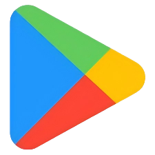

# 目录 <!-- omit in toc -->
- [Google Play Store](#google-play-store)
  - [安装](#安装)
  - [特点](#特点)
  - [常见问题](#常见问题)
  - [相关链接](#相关链接)

#  Google Play Store

Google Play Store 是 Android 官方应用商店，预装在绝大多数 Android 设备上，提供应用、游戏、电影、图书等数字内容的分发与更新服务。

部分设备（如中国大陆发行的手机、第三方自定义 ROM）未预装 Google Play 服务，需手动安装 Google Mobile Services (GMS) 后方可使用。

## 安装

大多数设备已预装 Google Play Store，无需额外安装。以下场景需手动安装：

| 场景 | 安装方式 |
|------|---------|
| 中国大陆行货手机 | 安装 GMS 框架（通常通过系统自带「谷歌服务助手」或厂商应用商店搜索 "Google Play" 安装器） |
| 自定义 ROM（无 GMS） | 刷入 MindTheGapps / NikGapps 包，或安装 microG 替代框架 |
| 华为手机（无 GMS） | 可通过 microG + Aurora Store 或第三方工具安装（功能受限） |

> 对于不需要完整 GMS 的设备，推荐使用 [Aurora Store](../app-store/Aurora-Store.md) 作为替代客户端。

## 特点

| 特点 | 说明 |
|------|------|
| 官方分发 | Google 官方应用分发渠道，应用经过 Play Protect 安全扫描 |
| 自动更新 | 支持应用自动更新，可设置仅 Wi-Fi 下更新 |
| 家庭共享 | Family Library 支持与家人共享已购买的应用 |
| Play Protect | 内置恶意软件扫描和浏览器保护 |
| 家长控制 | 可设置内容分级限制和应用安装审批 |

## 常见问题

**"Google Play 服务已停止"**：清除 Google Play 服务、Google Play 商店、Google Services Framework 的缓存和数据后重启设备。若仍无效，需重新安装 GMS。

**"设备未通过认证"**：未认证的设备可能无法使用部分 Google 应用（如 Google Pay）。可尝试在 [Google 设备注册页面](https://www.google.com/android/uncertified/) 手动注册 GSF ID。

**应用下载缓慢**：部分运营商或地区可能存在 Google Play CDN 连接问题，可尝试切换网络（如 Wi-Fi ↔ 移动数据）或使用代理。

## 相关链接

- [Google Play 开发者政策](https://play.google.com/about/developer-content-policy/)
- [Google Play Protect](https://developers.google.com/android/play-protect/)
- [Android 设备认证帮助](https://support.google.com/googleplay/answer/7165974)
