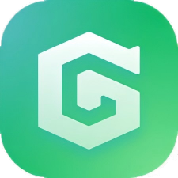

# 目录 <!-- omit in toc -->
- [ Gbox (实测好用!)](#-gbox-实测好用)
  - [安装](#安装)
  - [核心功能](#核心功能)
  - [支持的谷歌应用](#支持的谷歌应用)
  - [使用提示](#使用提示)
  - [相关链接](#相关链接)

#  Gbox (实测好用!)

**推荐与 [Aurora Store](Aurora-Store.md) 搭配使用**:
- 不依赖 GMS 的应用直接使用 `Aurora Store` 下载即可
- 强依赖 GMS 的应用使用 `Gbox` 容器下载运行(会有微小性能损耗，但至少可以使用)
---

GBox 是一款系统工具类应用，主要功能是帮助 Android 设备（特别是未内置谷歌移动服务 GMS 的机型，如部分华为手机）绕过兼容性限制，顺利安装并使用谷歌系列应用。

它的主要核心亮点包括：
- 内置谷歌服务框架：无需用户额外复杂的刷机或配置
  - GBox 内部自带 GMS 和 Google Play 商店，方便用户直接下载并运行 YouTube、Google Maps、Gmail 等谷歌软件。
- 应用多开：支持同一应用在手机上"双开"（如同时登录两个 WhatsApp 或 Telegram 账号），满足商务与日常隔离的需求。
- 隐私保护：承诺不收集个人敏感数据，保障用户在使用外围应用时的数据安全。

## 安装

从 [GBox 官网](https://www.gboxlab.com/) 下载 APK 安装包，侧载到 Android 设备即可。安装前需在系统设置中允许「安装未知来源应用」。

> GBox 不依赖系统级 GMS 框架，因此无需 root 权限或解锁 Bootloader，安装即用。

## 核心功能

| 功能 | 说明 |
|------|------|
| 内置 GMS | 自带谷歌移动服务框架，无需刷机或复杂配置 |
| Google Play 商店 | App 内可直接访问 Play Store，下载和更新谷歌应用 |
| 应用双开 | 在同一设备上运行两个独立实例（如双开 WhatsApp、Telegram） |
| 沙箱隔离 | 谷歌应用运行在 GBox 沙箱内，不影响主机系统稳定性 |
| 隐私保护 | 不收集个人敏感数据，应用数据与主机系统隔离 |
| 无需 root | 所有功能均在用户态实现，无需获取 root 权限 |

## 支持的谷歌应用

以下谷歌应用经过 GBox 适配，可在无 GMS 的设备上正常运行：

| 应用 | 说明 |
|------|------|
| Google Play Store | 下载和管理应用 |
| YouTube / YouTube Music | 视频与音乐流媒体 |
| Google Maps | 地图导航 |
| Gmail | 邮件客户端 |
| Google Drive | 云存储与文件同步 |
| Google Photos | 照片备份与管理 |
| Google Chrome | 浏览器（支持账号同步） |
| WhatsApp / Telegram | 即时通讯（双开） |

> 其他依赖 Google Play 服务的第三方应用（如 Uber、Spotify 等）也可通过 GBox 内的 Play Store 安装运行。

## 使用提示

- **首次使用**：安装 GBox 后，按引导完成初始化。GBox 会自动下载并安装 GMS 核心组件，此过程需保持网络畅通。
- **通知推送**：应用的通知推送依赖 GBox 在后台运行，首次使用时需将 GBox 加入系统电池优化白名单，防止被后台清理。
- **应用更新**：GBox 内的谷歌应用通过内置 Play Store 更新，GBox 自身需从官网下载更新。
- **性能开销**：GBox 在后台运行会消耗额外内存和电量，低配机型建议仅在需要时启动。
- **与 Gspace 对比**：GBox 和 Gspace 功能相似（均提供内置 GMS + 双开），但 GBox 界面更简洁、广告更少，实测体验更佳。

---
## 相关链接

- [GBox 官网](https://www.gboxlab.com/)
