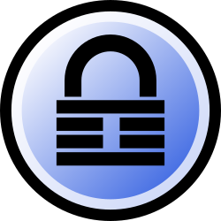

# 目录 <!-- omit in toc -->
- [ KeePass](#-keepass)
  - [安装](#安装)
    - [Windows](#windows)
    - [Linux](#linux)
    - [macOS / iOS / Android](#macos--ios--android)
  - [快速入门](#快速入门)
  - [常用配置](#常用配置)
    - [中文语言包](#中文语言包)
    - [数据库与同步](#数据库与同步)
    - [主密码与密钥文件](#主密码与密钥文件)
    - [自动输入](#自动输入)
    - [插件](#插件)
  - [与 KeePassXC 的关系](#与-keepassxc-的关系)
  - [安全建议](#安全建议)
  - [相关链接](#相关链接)
    - [回到 password](#回到-password)

#  KeePass

KeePass 是一款免费、开源、以本地数据库为核心的密码管理器。它将账号、密码、备注、附件等信息保存在 `.kdbx` 数据库文件中，并通过主密码、密钥文件等方式解锁，适合偏好离线保存、便携使用和自行控制同步方式的用户。

> 一般用户建议选择 KeePass 2.x。KeePass 官方桌面端主要面向 Windows，Linux、macOS、移动端可使用 KeePass 兼容客户端或通过 Mono 运行。

## 安装

### Windows

推荐从 [KeePass 官方下载页](https://keepass.info/download.html) 获取 KeePass 2.x。

| 版本 | 适合场景 |
|------|---------|
| Installer | 固定在一台电脑长期使用，自动创建开始菜单和桌面快捷方式 |
| Portable | 放在 U 盘、同步盘或工具目录中使用，便于整体迁移和备份 |

```bash
# WinGet
winget install DominikReichl.KeePass
```

也可下载 Portable 压缩包，解压到如 `D:\Tools\KeePass` 的非系统目录后运行 `KeePass.exe`。

### Linux

KeePass 官方说明 KeePass 2.x 支持通过 Mono 在 Linux、macOS、BSD 等系统上运行；官方下载安装包仍以 Windows 为主，Linux 发行版中的 `keepass2` 通常属于发行版或社区维护的非官方打包版本。

```bash
# Ubuntu / Debian
sudo apt update
sudo apt install keepass2
```

如果希望获得更原生的 Linux 桌面体验，也可以考虑兼容 KeePass 数据库格式的 KeePassXC。

### macOS / iOS / Android

KeePass 官方下载页列出了多个兼容客户端。常见选择：

| 平台 | 客户端 |
|------|--------|
| macOS | KeePassXC、MacPass、KeePassium、Strongbox |
| iOS / iPadOS | KeePassium、Strongbox |
| Android | KeePassDX、KeePass2Android、KeePassDroid |

这些客户端通常可以打开 KeePass 2.x 的 `.kdbx` 数据库，但功能细节、同步方式和插件支持可能不同，建议先用测试数据库确认兼容性。

## 快速入门

1. **新建数据库**：打开 KeePass，选择 `File` → `New`，创建一个 `.kdbx` 数据库文件。
2. **设置主密码**：使用足够长的主密码，建议采用短语式密码而不是简单单词。
3. **添加条目**：为每个网站或应用单独建立记录，保存用户名、密码、URL 和备注。
4. **生成强密码**：新增条目时使用内置密码生成器，避免复用旧密码。
5. **保存与备份**：数据库是单个文件，定期复制到备份位置，并保留历史版本。

## 常用配置

### 中文语言包

KeePass 默认界面通常为英文，可通过语言包切换为简体中文：

1. 打开 `View` → `Change Language`。
2. 点击 `Get More` 进入官方语言包页面。
3. 下载 `Chinese, Simplified` 对应的语言包。
4. 将解压得到的 `.lngx` 文件放入 KeePass 的 `Languages` 目录。
5. 回到 `Change Language` 选择简体中文并重启 KeePass。

### 数据库与同步

- 数据库文件建议命名清晰，如 `passwords.kdbx`，放在固定目录中。
- 可将 `.kdbx` 放入 OneDrive、Dropbox、坚果云、Syncthing 等同步目录，实现多设备同步。
- 不建议只依赖同步盘，仍应定期离线备份数据库。
- 如果使用密钥文件，不要把密钥文件和数据库放在同一个同步目录中。

### 主密码与密钥文件

KeePass 支持多种解锁因素：

| 方式 | 说明 |
|------|------|
| 主密码 | 最常用方式，必须足够长且不可遗忘 |
| 密钥文件 | 需要同时持有一个本地文件才能解锁数据库 |
| Windows 用户账户 | 仅适合固定 Windows 环境，不利于跨平台迁移 |

更稳妥的做法是 `主密码 + 密钥文件`。密钥文件应单独备份，内容不要修改；文件名可以改，但文件内容变化会导致数据库无法解锁。

### 自动输入

KeePass 的 Auto-Type 可以根据窗口标题把用户名和密码输入到网页或软件登录框中。

常用做法：

1. 在条目中填写 `Title`、`User Name`、`Password` 和 `URL`。
2. 选中条目后按自动输入热键，默认通常为 `Ctrl + Alt + A`。
3. 如登录页输入顺序特殊，可在条目的 Auto-Type 配置中自定义序列。

> 自动输入依赖窗口标题匹配。遇到多个相似窗口时，应检查匹配规则，避免把密码输入到错误窗口。

### 插件

KeePass 支持插件扩展，可用于备份、导入导出、同步、浏览器集成等场景。

安装方式通常是：

1. 从 [KeePass 插件页](https://keepass.info/plugins.html) 或插件项目主页下载插件。
2. 将 `.plgx` 文件复制到 KeePass 的 `Plugins` 目录。
3. 重启 KeePass。

插件会接触密码数据库，建议只安装来源明确、维护活跃且确实需要的插件。

## 与 KeePassXC 的关系

KeePass 和 [KeePassXC](keepassxc.md) 都围绕 KeePass 系列数据库工作，常见 `.kdbx` 数据库可以在两者之间迁移或共用，但它们不是同一个项目。

| 对比项 | KeePass | KeePassXC |
|--------|---------|-----------|
| 项目定位 | 原始 KeePass 项目，插件生态丰富 | 社区维护的跨平台原生客户端 |
| 桌面平台 | 官方主要面向 Windows，其他平台可通过 Mono 或兼容客户端使用 | 官方支持 Windows、macOS、Linux |
| 数据格式 | KeePass 2.x 使用 KDBX | 创建、打开和保存 KeePass 兼容 KDBX |
| 插件 | 支持 KeePass 2.x 插件 | 不兼容 KeePass 2.x 插件，更多功能内置 |
| 浏览器集成 | 通常依赖插件或第三方方案 | 官方提供 KeePassXC Browser 配套扩展 |
| 推荐场景 | 需要 KeePass 插件、使用 Windows 或偏好原项目 | 需要原生跨平台体验、浏览器集成、Linux/macOS 桌面使用 |

如果只是想使用 KeePass 数据库格式，并希望在 Linux 或 macOS 上获得更原生的桌面体验，可以优先查看 [KeePassXC](keepassxc.md)。如果已经依赖 KeePass 2.x 插件，则应先确认 KeePassXC 是否内置或支持对应功能。

## 安全建议

- 主密码丢失后通常无法恢复数据库，请在安全位置保存恢复方案。
- 开启剪贴板自动清空，减少密码长时间停留在剪贴板的风险。
- 设置空闲自动锁定、最小化锁定或系统锁屏时锁定数据库。
- 数据库同步前确认云盘账号本身已开启两步验证。
- 导出 CSV、TXT 等明文文件后应立即安全删除，避免长期遗留。
- 大版本升级、插件更新或跨客户端迁移前，先备份 `.kdbx` 数据库。

## 相关链接

- [KeePass 官网](https://keepass.info/)
- [KeePass 下载页](https://keepass.info/download.html)
- [KeePass 功能列表](https://keepass.info/features.html)
- [KeePass 插件](https://keepass.info/plugins.html)
- [KeePass 语言包](https://keepass.info/translations.html)
- [KeePassXC](keepassxc.md)
- [Keepass 使用入门教程 - 博客园](https://www.cnblogs.com/xututu6/p/18775749)
- [KeePass 教程 - 知乎专栏](https://zhuanlan.zhihu.com/p/39645975/)

---

### [回到 password](README.md)
