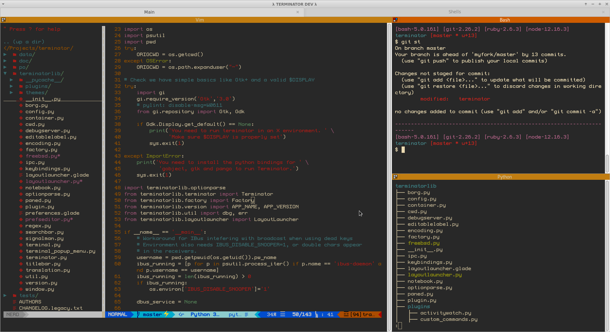
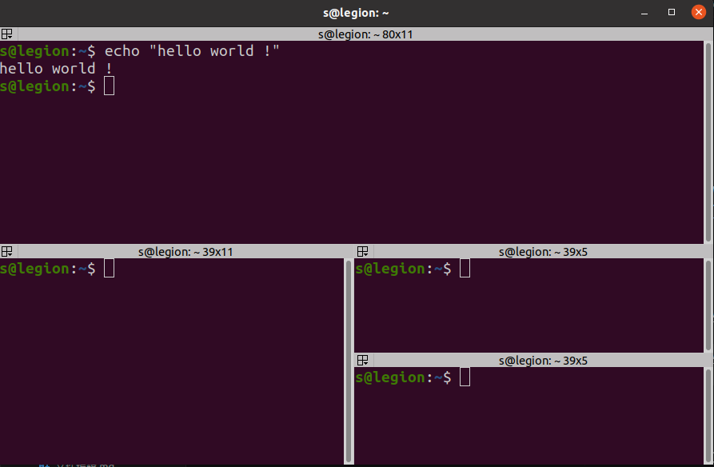

# 目录 <!-- omit in toc -->
- [ Terminator](#-terminator)
  - [安装](#安装)
    - [Ubuntu](#ubuntu)
  - [快速入门](#快速入门)
  - [相关配置](#相关配置)

#  [Terminator](https://gnome-terminator.readthedocs.io/)

在一个窗口中显示多个GNOME终端！




## 安装

Terminator 几乎适用于所有 Linux 发行版，可通过发行版的二进制软件包仓库获取。
强烈建议使用操作系统自带的软件包管理系统安装 Terminator，而不是自己运行 setup.py 文件。

### Ubuntu
如果您运行的是 Ubuntu 20.04 或更高版本，则可以运行
```bash
sudo add-apt-repository ppa:mattrose/terminator
sudo apt-get update
sudo apt install terminator
```
详细安装指南请参阅 [github安装文档](https://github.com/gnome-terminator/terminator/blob/master/INSTALL.md)


## 快速入门

**通过以下方式创建更多终端：**

水平分割：`Ctrl-Shift-o`
垂直分割：`Ctrl-Shift-e`

**重点转移到：**

下一个终端：`Ctrl-Shift-n`
上一个终端：`Ctrl-Shift-p`

新标签页：`Ctrl-Shift-t`
新窗口：`Ctrl-Shift-i`

**关闭终端或标签页：**

`Ctrl-Shift-w`
或右键单击 -> 关闭

关闭窗口及其所有终端和标签页：`Ctrl-Shift-q`

重置缩放级别：`Ctrl-0`


github：https://github.com/gnome-terminator/terminator

## 相关配置
- [Ubuntu Terminator setting](Ubuntu%20_Terminator_setting.md)