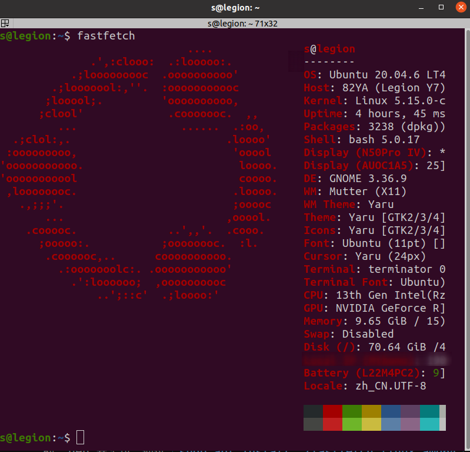

# 目录 <!-- omit in toc -->
- [fastfetch](#fastfetch)
  - [安装](#安装)
  - [使用](#使用)
- [字体安装](#字体安装)


##  fastfetch
系统信息展示工具 （neofetch的更新版）
是一款类似 neofetch 的系统信息展示工具，主要用 C 编写，强调性能和可定制性。

支持 Linux、macOS、Windows 7+、Android、FreeBSD、OpenBSD、NetBSD、DragonFly、Haiku、Su

### 安装
**一般情况：**
```bash
sudo apt install fastfetch
```
**无法定位软件包**
添加官方推荐的 PPA 软件源来进行安装(不推荐，会导致软件源污染)：
```bash
sudo add-apt-repository ppa:zhangsongcui3371/fastfetch
sudo apt update
sudo apt install fastfetch
```
此外，也可以直接前往 Fastfetch 的 [GitHub Releases](https://github.com/fastfetch-cli/fastfetch/releases) 页面，下载对应架构的 .deb 安装包，通过 `sudo apt install ./fastfetch_linux_amd64.deb` 命令进行本地安装。

### 使用

- 默认运行：`fastfetch`
- 查看所有可用模块示例：`fastfetch -c all.jsonc`
- 以 JSON 输出指定模块：`fastfetch -s <module1>[:<module2>] --format json`
- 完整命令行帮助：`fastfetch --help`
- 生成最小配置：`fastfetch --gen-config [</path/to/config.jsonc>]`
  - 生成完整配置：`fastfetch --gen-config-full`
  - 请使用支持 JSON schema 的编辑器（如 VSCode）编辑配置文件！
  - 如果你连接 Github 有网络困难（智能提示不生效），可将配置文件中的 `$schema` 的值替换为 `https://gitee.com/carterl/fastfetch/raw/dev/doc/json_schema.json`


## 字体安装
1. 下载字体文件
2. 将字体文件复制到系统字体目录：`/usr/share/fonts/`
   （可以增加子目录）
3. 更新字体缓存
    ```bash
    sudo fc-cache -rv
    ```
4. 可能需要增加权限
    ```bash
    # 先修复目录权限（目录需要 755，即所有人可进入和列出）
    sudo chmod 755 /usr/share/fonts/truetype/windows-fonts

    # 再修复所有字体文件权限（文件需要 644，即所有人可读）
    sudo chmod 644 /usr/share/fonts/truetype/windows-fonts/*
    ```

5. 检查是否安装成功
    ```bash
    # 检查宋体
    fc-list | grep -i "simsun"

    # 检查楷体
    fc-list | grep -i "kaiti"
    ```

---

### [回到 Linux/Optional](README.md)
