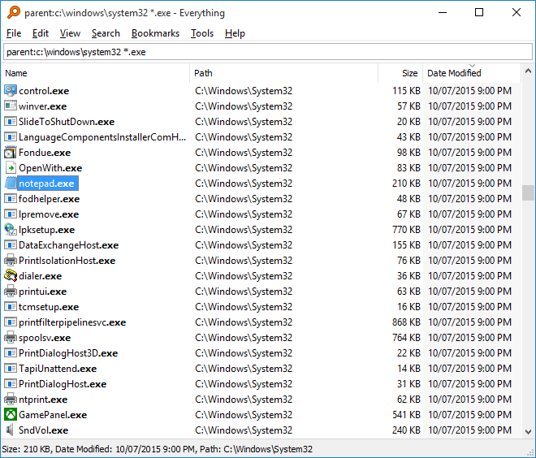

# 目录 <!-- omit in toc -->
- [ Everything](#-everything)
  - [安装](#安装)
  - [快速入门](#快速入门)
  - [命令行工具 (es.exe)](#命令行工具-esexe)
  - [常用搜索语法](#常用搜索语法)
  - [相关链接](#相关链接)

#  Everything

[Everything](https://www.voidtools.com/zh-cn/) 是一款 Windows 平台的文件名搜索工具，通过直接读取 NTFS 文件系统的主文件表（MFT）实现近乎即时的搜索结果。与 Windows 自带搜索相比，Everything 的索引速度极快、资源占用极低，是 Windows 上效率最高的文件定位工具之一。



> **注意**：Everything 是 Windows 平台专用工具，仅支持 NTFS 文件系统。如需在其他平台或非 NTFS 卷上使用，可搭配 Everything 的文件夹索引功能，或参考本目录下的 [[ripgrep]](ripgrep.md) 等跨平台替代方案。

## 安装

```bash
# winget
winget install voidtools.Everything

# Scoop
scoop install everything

# Chocolatey
choco install everything
```

也可从[官网下载页面](https://www.voidtools.com/zh-cn/download/)获取安装版（推荐）或便携版。安装时建议勾选"安装 Everything 服务"，以便普通用户权限下也能读取 NTFS MFT。

## 快速入门

安装完成后 Everything 会自动建立索引，在搜索框中输入关键词即可实时显示匹配结果。

**基本操作：**

| 操作 | 快捷方式/说明 |
|------|--------------|
| 搜索文件 | 直接输入文件名（支持部分匹配） |
| 打开文件/文件夹 | 双击结果，或选中后按 `Enter` |
| 在资源管理器中定位 | 右键 → "打开文件位置" |
| 复制完整路径 | `Ctrl + Shift + C` |
| 排除指定路径 | 工具 → 选项 → 索引 → 排除列表 |

## 命令行工具 (es.exe)

Everything 提供了独立的命令行搜索工具 `es.exe`，从 [下载页面](https://www.voidtools.com/zh-cn/download/) 获取后放入 Everything 安装目录即可使用：

```bash
# 搜索文件名包含 "report" 的文件
es.exe report

# 搜索扩展名为 .md 且包含 "todo" 的文件
es.exe "*.md ext:md" -sort date-modified

# 仅搜索 D 盘
es.exe "parent:D:\ ext:mkv"

# 导出结果为 CSV
es.exe "ext:pdf" -export-csv results.csv

# 仅显示文件（排除文件夹）
es.exe -no-folder keyword
```

## 常用搜索语法

| 语法 | 说明 | 示例 |
|------|------|------|
| `ext:md` | 按扩展名筛选 | `ext:pdf` |
| `folder:` | 仅搜索文件夹 | `folder:project` |
| `file:` | 仅搜索文件 | `file:report` |
| `size:>1mb` | 按文件大小筛选 | `size:>100mb` |
| `dm:today` | 按修改日期筛选 | `dm:thisweek`、`dm:2025-01` |
| `dc:last7days` | 按创建日期筛选 | `dc:today` |
| `regex:` | 启用正则表达式 | `regex:report_\d{4}` |
| `!` | 排除关键词 | `draft !final` |
| `<\|>` | 或运算 | `jpg \| png \| gif` |
| `""` | 精确匹配 | `"C:\Program Files"` |

多个条件可组合使用，例如：
```
ext:md "weekly-report" dm:last7days
```

## 相关链接

- [官网（中文）](https://www.voidtools.com/zh-cn/)
- [下载页面](https://www.voidtools.com/zh-cn/download/)
- [搜索语法帮助](https://www.voidtools.com/support/everything/searching/)
- [命令行 es.exe 文档](https://www.voidtools.com/support/everything/command_line_interface/)


---

### [回到 效率与自动化](README.md)
