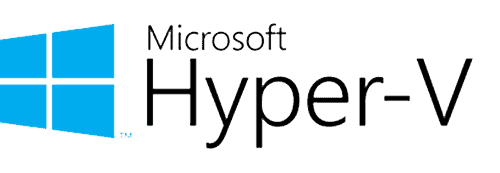

# 目录 <!-- omit in toc -->
- [Microsoft Hyper-V](#microsoft-hyper-v)
  - [安装（启用 Hyper-V）](#安装启用-hyper-v)
    - [PowerShell 命令行](#powershell-命令行)
    - [图形界面](#图形界面)
    - [DISM 命令](#dism-命令)
  - [使用方法](#使用方法)
  - [核心功能](#核心功能)
  - [Hyper-V 管理器速查](#hyper-v-管理器速查)
  - [相关链接](#相关链接)



# Microsoft Hyper-V

Hyper-V 是微软为 Windows 系统打造的原生虚拟化平台，采用 Type 1 裸金属架构（Hypervisor 直接运行在硬件之上），相比 Type 2 桌面虚拟机软件（如 VirtualBox、VMware Workstation）具有更高的性能和更低的资源开销。

Hyper-V 以 Windows 功能的形式内置，启用后可将一台物理机划分为多个隔离的虚拟机，每个虚拟机运行独立的操作系统。

**支持的平台：**
- Windows 10/11 Pro、Enterprise、Education（64 位）
- Windows Server（所有主流版本）
- 不支持 Windows Home 版（可通过第三方脚本启用，但不保证稳定性）

> **硬件前提：** CPU 需支持虚拟化技术（Intel VT-x 或 AMD-V），并在 BIOS/UEFI 中开启。内存建议至少 8 GB。

## 安装（启用 Hyper-V）

Hyper-V 是 Windows 内置功能，无需额外下载。通过以下任一方式启用，重启后生效。

### PowerShell 命令行

```powershell
# 以管理员身份运行 PowerShell，启用全部 Hyper-V 组件
Enable-WindowsOptionalFeature -Online -FeatureName Microsoft-Hyper-V-All
```

### 图形界面

1. 打开「控制面板」→「程序」→「启用或关闭 Windows 功能」
2. 勾选「Hyper-V」及其所有子组件
3. 点击「确定」，按提示重启系统

### DISM 命令

```cmd
DISM /Online /Enable-Feature /All /FeatureName:Microsoft-Hyper-V
```

## 使用方法

1. **打开 Hyper-V 管理器**：在开始菜单搜索「Hyper-V 管理器」，或按 `Win + R` 输入 `virtmgmt.msc`。
2. **配置虚拟交换机**：在右侧操作面板点击「虚拟交换机管理器」→ 创建虚拟交换机（外部/内部/专用），为虚拟机提供网络连接。
3. **创建虚拟机**：点击「新建」→「虚拟机」，按向导配置名称、代数（推荐第 2 代）、内存、网络适配器、虚拟硬盘。
4. **安装操作系统**：在虚拟机设置中挂载 ISO 镜像文件，启动虚拟机后按正常流程安装系统。
5. **安装集成服务**：Hyper-V 内置 Linux Integration Services (LIS)，Windows 虚拟机自动集成；Linux 发行版通常已内置 LIS 内核模块。

## 核心功能

| 功能 | 说明 |
|------|------|
| 虚拟交换机 | 支持外部（共享物理网卡）、内部（仅主机内部通信）、专用（仅虚拟机之间）三种模式 |
| 检查点 | 虚拟机快照，保存当前运行状态，随时回滚（替代旧版"快照"概念） |
| 动态内存 | 根据虚拟机实际负载自动调整内存分配，提高物理内存利用率 |
| 增强会话模式 | 支持剪贴板共享、驱动器重定向、USB 设备直通、分辨率自适应 |
| 嵌套虚拟化 | 在虚拟机内再次运行 Hyper-V 或其他虚拟化平台（需第 2 代虚拟机） |
| PowerShell Direct | 通过 PowerShell 直接连接到虚拟机内部（即使虚拟机无网络），用于自动化管理 |
| 快速创建 | Hyper-V 管理器内置「快速创建」，可选择 Ubuntu 等预配置镜像一键部署 |
| 实时迁移 | 在不中断服务的情况下将运行中的虚拟机从一台物理主机迁移到另一台（Windows Server） |
| 复制 | 将虚拟机异步复制到备用主机，实现灾难恢复（Windows Server） |

## Hyper-V 管理器速查

| 操作 | 方法 |
|------|------|
| 打开管理器 | `Win + R` → `virtmgmt.msc` |
| 强制关闭虚拟机 | 右键虚拟机 →「关闭」（等效于拔电源） |
| 正常关机 | 在虚拟机内执行系统关机，或右键 →「关机」 |
| 应用检查点 | 右键虚拟机 →「检查点」→ 选择检查点 →「应用」 |
| 连接虚拟机 | 双击虚拟机，或在右键菜单选择「连接」 |
| 修改虚拟机设置 | 右键虚拟机 →「设置」（部分设置需先关机） |

## 相关链接

- [Hyper-V 官方文档](https://learn.microsoft.com/zh-cn/windows-server/virtualization/hyper-v/)
- [Hyper-V 系统要求](https://learn.microsoft.com/zh-cn/virtualization/hyper-v-on-windows/reference/hyper-v-requirements)
- [在 Windows 上启用 Hyper-V](https://learn.microsoft.com/zh-cn/virtualization/hyper-v-on-windows/quick-start/enable-hyper-v)
- [Linux 虚拟机集成服务](https://learn.microsoft.com/zh-cn/windows-server/virtualization/hyper-v/supported-linux-and-freebsd-virtual-machines-for-hyper-v)
