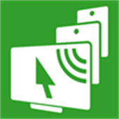

# 目录 <!-- omit in toc -->
- [ Spacedesk](#-spacedesk)
  - [安装](#安装)
    - [主机端（Windows）](#主机端windows)
    - [客户端（副屏设备）](#客户端副屏设备)
  - [快速入门](#快速入门)
  - [功能速览](#功能速览)
  - [使用提示](#使用提示)
  - [相关链接](#相关链接)

#  Spacedesk

Spacedesk 是一款多屏扩展与远程显示软件，其核心功能是将智能手机、平板电脑、其他笔记本电脑或具备浏览器的设备转化为 Windows 主机的第二块显示器。用户可以通过局域网、无线网络或 USB 数据线将设备连接，轻松实现桌面的扩展或镜像复制。主控端驱动程序专为 Windows 操作系统设计，而客户端应用则覆盖 Android、iOS、亚马逊设备、Windows 系统以及基于 HTML5 的网页浏览器，意味着几乎任何带有屏幕和网络功能的设备都可以被低成本地改造为副屏。

除了基础的屏幕投射功能，Spacedesk 还集成了多种进阶的输入输出控制特性。它具备软件级别的 KVM 切换器功能，允许用户通过副屏设备（平板或手机）上的触摸屏、触控笔、外接键盘和鼠标来反向操作 Windows 主机，极大提升了交互的便利性。同时，该软件支持音频重定向功能，可以将主机的声音同步传输到副屏设备上播放。对于需要更大显示面积的用户，它还提供了视频墙模式，能够将多块屏幕拼接在一起展示仪表盘或创意内容。

## 安装

### 主机端（Windows）

主控端驱动程序仅支持 Windows，需安装在将要扩展屏幕的主机上。

```bash
# winget
winget install spacedesk
```

也可从[官网下载页](https://www.spacedesk.net/download/)获取 `.msi` 或 `.exe` 安装包，安装完成后需重启系统。

### 客户端（副屏设备）

客户端安装在作为副屏的设备上：

| 平台 | 获取方式 |
|------|---------|
| Android | Google Play 搜索 "spacedesk"，或从官网下载 APK |
| iOS / iPadOS | App Store 搜索 "spacedesk" |
| Windows | 从官网下载 spacedesk Windows VIEWER 安装包 |
| 网页浏览器 | 直接访问 spacedesk 提供的 HTML5 网页客户端 |

> 主机端与客户端需连接至**同一局域网**才能自动发现；使用 USB 连接时需在客户端开启 USB 共享模式。

## 快速入门

1. **安装驱动**：在 Windows 主机上安装 spacedesk 驱动并重启。
2. **连接客户端**：在副屏设备上打开 spacedesk 客户端应用，确保两台设备在同一局域网内。
3. **自动发现**：客户端应自动发现主机，点击连接即可。若未发现，可手动输入主机 IP 地址。
4. **调整布局**：在 Windows 显示设置或 spacedesk 控制面板中调整副屏位置和分辨率。

## 功能速览

| 功能 | 说明 |
|------|------|
| 屏幕扩展 / 镜像 | 将副屏作为扩展显示器或复制主屏内容 |
| 触屏交互 | 支持在副屏上触控操作，适配触摸屏和触控笔 |
| KVM 反控 | 通过副屏的键盘/鼠标/触控反向操作主机 |
| 音频重定向 | 将主机音频传输到副屏设备播放 |
| 视频墙模式 | 多块屏幕拼接，适合大尺寸展示场景 |
| 多客户端连接 | 一台主机可同时连接多个副屏设备 |
| USB 连接 | 通过 USB 数据线连接，避免无线延迟 |

## 使用提示

- **网络条件**：建议使用 5GHz Wi-Fi 或有线网络以保证画面流畅，2.4GHz Wi-Fi 可能在传输高帧率画面时出现延迟或压缩。
- **分辨率设置**：在 spacedesk 控制面板或 Windows 显示设置中，可将副屏分辨率设为设备原生分辨率以获得最佳清晰度。
- **USB 连接**：部分 Android 设备需要在开发者选项中开启"USB 网络共享"才能通过 USB 连接。
- **防火墙提示**：若客户端无法发现主机，请检查 Windows 防火墙是否允许 spacedesk 通过专用/公用网络。
- **版本兼容**：主机端驱动与客户端的版本号应尽量保持一致，避免功能异常。

## 相关链接

- [Spacedesk 官方网站 (中文)](https://www.spacedesk.net/zh/)
- [Spacedesk 下载页面](https://www.spacedesk.net/zh/downloads/)
- [Spacedesk 用户手册](https://manual.spacedesk.net/)


---

### [回到 remote-desktop](README.md)
