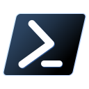

<!-- software-count: 4 -->
# 目录 <!-- omit in toc -->
- [ Windows Terminal](#-windows-terminal)
  - [安装](#安装)
  - [使用](#使用)
- [ Powershell 7](#-powershell-7)
  - [安装](#安装-1)
  - [配置](#配置)
- [ MobaXterm (推荐)](#-mobaxterm-推荐)
  - [安装](#安装-2)
  - [核心功能](#核心功能)
  - [使用提示](#使用提示)
- [  Tabby](#--tabby)
  - [安装](#安装-3)
- [相关链接](#相关链接)
    - [回到 Windows/Optional](#回到-windowsoptional)


写在篇首：Windows Terminal 是**终端模拟器**（负责显示界面），PowerShell 7 是**Shell 运行环境**（负责执行命令），两者互相独立、可以组合使用。推荐将 PowerShell 7 设为 Windows Terminal 的默认 Shell，获得最佳体验。
#  Windows Terminal

Windows Terminal 是微软为 Windows 10/11 打造的现代终端模拟器，支持多标签页、窗格分割、GPU 加速文本渲染、完全自定义的主题与配色方案，可在一个窗口中同时运行 PowerShell、CMD、WSL、Azure Cloud Shell 等多种命令行环境。

> Windows 11 已将 Windows Terminal 设为默认终端应用。如果你是 Windows 10 用户，建议安装后将其设为默认终端。

## 安装

```bash
# winget
winget install Microsoft.WindowsTerminal

# Scoop
scoop install windows-terminal

# Chocolatey
choco install microsoft-windows-terminal
```

也可从 [Microsoft Store](https://apps.microsoft.com/detail/9n0dx20hk701) 或 [GitHub Releases](https://github.com/microsoft/terminal/releases) 获取。

## 使用

| 操作 | 快捷键 |
|------|--------|
| 新建标签页 | `Ctrl + Shift + T` |
| 关闭标签页 | `Ctrl + Shift + W` |
| 切换标签页 | `Ctrl + Tab` |
| 垂直分屏 | `Alt + Shift + +` |
| 水平分屏 | `Alt + Shift + -` |
| 切换窗格 | `Alt + ←/→/↑/↓` |
| 查找 | `Ctrl + Shift + F` |
| 打开设置（JSON） | `Ctrl + Shift + ,` |
| 打开设置（GUI） | `Ctrl + ,` |

**配置文件**：所有设置保存在 `settings.json` 中，可通过 GUI 界面编辑，也可直接编辑 JSON 文件。常用自定义项包括配色方案、字体（推荐 Cascadia Code）、背景图片/透明度、启动默认 Shell 等。

#  Powershell 7

PowerShell 7（命令名 `pwsh`）是 PowerShell 的开源跨平台版本，基于 .NET 构建，是 Windows PowerShell 5.1 的现代继任者。相比 5.1，它新增了管道链操作符（`&&`、`||`）、三元运算符、空合并运算符（`??`）、`ForEach-Object -Parallel` 并行处理等特性，同时与 Windows PowerShell 5.1 共存，互不干扰。

> Windows 内置的 `powershell.exe` 是 5.1 版本；安装 PowerShell 7 后使用 `pwsh` 命令启动。

## 安装

```powershell
# winget（推荐）
winget install Microsoft.PowerShell

# Scoop
scoop install pwsh
```

也可从 [GitHub Releases](https://github.com/PowerShell/PowerShell/releases) 下载 `.msi` 安装包。

## 配置

**设置 Windows Terminal 默认 Shell**：打开 Windows Terminal 设置 → 启动 → 默认配置文件 → 选择 `PowerShell`（图标为黑色背景，即 pwsh 7）。

**配置文件**：运行 `code $PROFILE` 可打开 PowerShell 配置脚本，用于设置别名、函数、提示符等。首次使用需先创建：

```powershell
New-Item -ItemType File -Path $PROFILE -Force
```

**Oh My Posh**（可选）：美化提示符的工具，支持 Git 状态显示、主题切换。

```powershell
winget install JanDeLaHaye.OhMyPosh
```

#  MobaXterm (推荐)

MobaXterm 是一款面向 Windows 的一体化远程计算工具，集成了终端模拟器、X11 服务器、SSH / Telnet / RDP / VNC / FTP / SFTP 等多种网络客户端，并内置了常见的 Unix 命令集（基于 Cygwin），使用一个便携可执行文件即可满足绝大多数远程管理与开发需求。

## 安装

1. 访问[官网](https://mobaxterm.mobatek.net/)下载安装版（Installer）或便携版（Portable）。
2. 免费版（Home Edition）功能已覆盖大多数日常使用场景，付费版提供更多会话数、自定义宏等高级功能。

## 核心功能

| 功能 | 说明 |
|------|------|
| SSH 客户端 | 支持密码/密钥认证，自带会话管理器，可保存常用连接 |
| X11 服务器 | 在 Windows 上运行 Linux GUI 程序，自动处理 X11 转发 |
| SFTP 浏览器 | SSH 连接后自动在侧边栏打开远程文件管理器，支持拖拽传输 |
| 内置 Unix 工具集 | 基于 Cygwin，提供 `ls`、`grep`、`awk`、`sed`、`rsync` 等常用命令 |
| 宏录制 | 录制并回放终端操作，适合批量管理多台服务器 |
| 多执行器 | 同时在多个终端中发送相同命令 |

## 使用提示

- **中文乱码**：连接 Linux 服务器时，在会话设置中将终端编码设为 `UTF-8 (unicode)`。
- **中文汉化**：社区提供了[汉化补丁](https://github.com/RipplePiam/MobaXterm-Chinese-Simplified)，可参考仓库说明安装。
- **会话备份**：所有会话信息存储在 `MobaXterm.ini` 中，迁移时备份该文件即可。
- **与 Windows Terminal 配合**：可用 MobaXterm 的 X 服务器配合 Windows Terminal 中的 WSL / SSH 使用，各取所长。

# <a id="Tabby"></a>  Tabby

[回到Linux\Essential\terminal](../../Linux/Essential/terminal/README.md)

[Tabby](https://tabby.sh/)（原名 Terminus）是一款基于 Electron 的跨平台终端模拟器，支持 Windows、macOS 和 Linux。内置 SSH / SFTP 客户端，提供可插拔插件系统和丰富的主题选项，适合追求现代 UI 与跨平台一致体验的用户。

## 安装

```bash
# winget
winget install Eugeny.Tabby

# Scoop
scoop install tabby
```

也可从 [GitHub Releases](https://github.com/Eugeny/tabby/releases) 获取便携版。

# 相关链接

- [Windows Terminal — GitHub](https://github.com/microsoft/terminal)
- [Windows Terminal — 官方文档](https://learn.microsoft.com/zh-cn/windows/terminal/)
- [MobaXterm — 官网](https://mobaxterm.mobatek.net/)
- [MobaXterm — 汉化项目](https://github.com/RipplePiam/MobaXterm-Chinese-Simplified)
- [Tabby — 官网](https://tabby.sh/)


---

### [回到 Windows/Optional](README.md)
