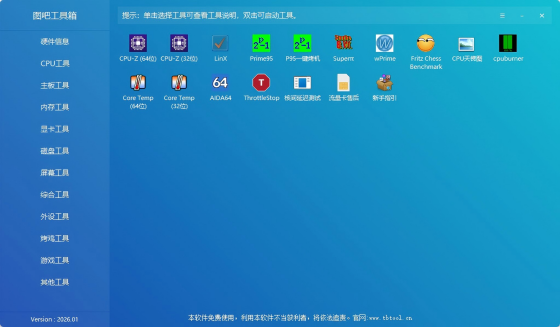

# 目录 <!-- omit in toc -->
- [图拉丁吧工具箱](#图拉丁吧工具箱)
  - [安装](#安装)
  - [内置工具速览](#内置工具速览)
  - [常用场景](#常用场景)
  - [注意事项](#注意事项)
  - [相关链接](#相关链接)

# 图拉丁吧工具箱

图拉丁吧工具箱（简称图吧工具箱）是一款面向 PC 爱好者的 Windows 系统检测与硬件测试工具集，由"图拉丁吧"社区维护。它本身是一个启动器，将数十款常用的免费硬件工具集成在一个界面中，涵盖 CPU、内存、显卡、硬盘、屏幕、外设等各类硬件的检测、跑分与压力测试，省去逐一寻找和下载的麻烦。

> 图吧工具箱本身不含恶意代码，但部分防病毒软件可能对其启动器或内置工具报毒（误报），建议从官网下载并自行甄别。

## 安装

1. 访问[官网](https://www.tbtool.cn/)下载最新版本的安装包（`.exe` 或 `.zip`）。
2. 推荐下载完整版以获取全部内置工具，也可按需选择精简版。
3. 解压或安装到任意目录即可运行。

> 图吧工具箱为绿色软件，无需安装到系统目录，可直接放在非系统盘使用。

## 内置工具速览

图吧工具箱按功能分类集成了以下常用工具：

| 分类 | 工具（部分） | 用途 |
|------|-------------|------|
| CPU | CPU-Z、Core Temp、Prime95 | 处理器信息、温度监控、压力测试 |
| 内存 | MemTest、Thaiphoon Burner | 内存稳定性测试、SPD 信息读取 |
| 显卡 | GPU-Z、FurMark、MSI Afterburner | 显卡信息、烤机测试、超频与监控 |
| 硬盘 | CrystalDiskInfo、CrystalDiskMark、DiskGenius | 硬盘健康状态、读写测速、分区管理 |
| 屏幕 | DisplayX、Dead Pixel Tester | 屏幕坏点检测、显示器综合测试 |
| 综合 | AIDA64、HWiNFO | 全硬件信息汇总、传感器监控 |
| 外设 | Keyboard Test、MouseTester | 键盘冲突测试、鼠标性能检测 |

## 常用场景

| 场景 | 推荐工具与操作 |
|------|---------------|
| 新机验机 | AIDA64 查看整机配置 → CPU-Z/GPU-Z 核对参数 → DisplayX 查坏点 → CrystalDiskInfo 看硬盘通电时间 |
| 内存稳定性排查 | MemTest 或 RunMemTestPro 跑至少 200% 覆盖 |
| 显卡烤机 | FurMark 运行 15~30 分钟，观察温度与是否花屏 |
| 硬盘测速 | CrystalDiskMark 跑顺序/随机读写 |
| 老机清灰前后对比 | AIDA64 稳定性测试 → 记录烤机温度前后差异 |
| 键鼠功能检测 | Keyboard Test 测试按键冲突，MouseTester 查看回报率 |

## 注意事项

- 压力测试工具（FurMark、Prime95 等）会推高硬件温度，请确保散热正常再进行长时间烤机。
- 部分老旧杀毒软件可能对图吧工具箱误报，如介意可将安装目录加入白名单。
- 内置工具均为各自作者的独立作品，图吧工具箱仅负责集成与启动，各工具的更新进度以原作者发布为准。
- 尝试超频或修改硬件参数前，请充分了解相关风险。

## 相关链接

- [官网](https://www.tbtool.cn/)
- [图吧工具站永久网址](https://github.com/AdingApkgg/tb/blob/gh-pages/README.md)
- [友情链接页](https://tb.saop.cc/links/)

---

### [回到 Windows/Optional](README.md)
