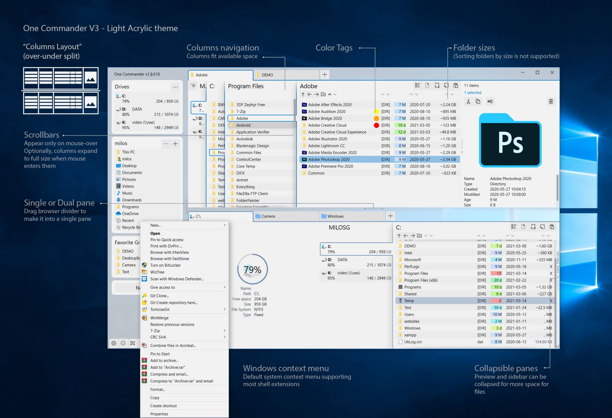

<!-- software-count: 1 -->
# 目录 <!-- omit in toc -->
- [OneCommander](#-onecommander)
  - [安装](#安装)
  - [功能特点](#功能特点)
  - [授权说明](#授权说明)
  - [相关链接](#相关链接)

<p align="center">
    
</p>

#  OneCommander

专为 Windows 10 / 11 设计的现代化文件管理器，界面简洁美观，支持多标签、双窗格与列导航模式。

## 安装

**Microsoft Store（推荐）**：在开始菜单搜索"OneCommander"或通过以下链接安装：

```
ms-windows-store://search/?query=OneCommander
```

**官网下载**：从 [onecommander.com](https://onecommander.com/) 下载安装包。

## 功能特点

- **多标签页管理**：像浏览器一样用标签页管理多个文件夹，快速切换，减少窗口堆叠
- **双窗格视图**：同时查看两个文件夹，拖放操作直观高效，适合整理与备份
- **列导航模式**：受 macOS Finder 启发，逐级展开目录树，层级关系一目了然
- **文件搜索与过滤**：按关键词、类型、大小、修改时间快速筛选定位
- **高度个性化界面**：自定义主题、颜色、布局，支持颜色标签分类文件夹
- **内置文件预览**：按空格键直接预览选中文件，支持多种格式，无需打开应用
- **高级重命名与脚本**：支持正则表达式批量重命名、文件批处理与脚本自动化
- **图片元数据**：预览图片时可显示 EXIF 与 GPS 信息

## 授权说明

家庭个人使用免费，部分高级功能（如高级主题、云存储集成）需激活 Pro 授权。

## 相关链接

- [OneCommander 官网](https://onecommander.com/)
- [Microsoft Store 页面](https://apps.microsoft.com/search?query=onecommander)

---

### [回到 Windows/Optional/文件管理器](README.md)
