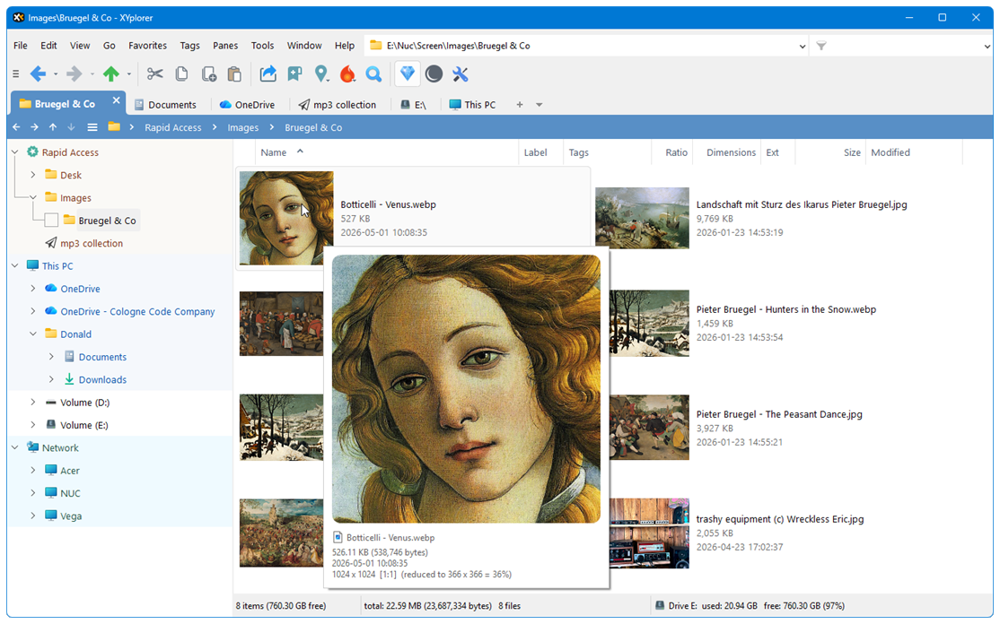

<!-- software-count: 1 -->
# 目录 <!-- omit in toc -->
- [XYplorer](#-xyplorer)
  - [安装](#安装)
  - [功能特点](#功能特点)
  - [授权说明](#授权说明)
  - [相关链接](#相关链接)

    

#  XYplorer

一款功能强大的 Windows 文件管理器，以多标签界面、灵活搜索和高度自定义著称，支持完全便携部署。

## 安装

**便携版（推荐）**：从官网下载 `.zip` 包，解压即用，无需安装，所有配置保存在程序目录内，不写注册表。

**安装版**：从官网下载 `.exe` 安装包，适合固定在某台机器使用。

> 下载地址：[xyplorer.com → Download](https://www.xyplorer.com/download.php)

## 功能特点

- **多标签浏览**：标签式界面，在同一窗口管理多个文件夹，快速切换
- **强大搜索**：支持文件名、内容、修改时间、大小等多条件高级搜索，定位精准
- **通用预览**：无需打开文件，直接预览文本、图片、音视频等多种格式
- **高度自定义**：可调整字体、颜色、布局、工具栏，支持深色模式
- **批量重命名**：内置重命名工具，支持规则批量操作
- **脚本支持**：内置脚本引擎，可为重复性任务编写自动化脚本，无需额外插件
- **便携性**：零安装、不改注册表，可放在 U 盘随身携带

## 授权说明

免费试用 30 天，试用版功能完整，限制极少：

- 图片预览左上角显示"XYplorer 试用版"水印
- 主窗口标题栏无法自定义

买断授权，无订阅费用。

## 相关链接

- [XYplorer 官网](https://www.xyplorer.com/)
- [官方文档](https://www.xyplorer.com/xyfc/viewforum.php?f=3)

---

### [回到 Windows/Optional/文件管理器](README.md)
